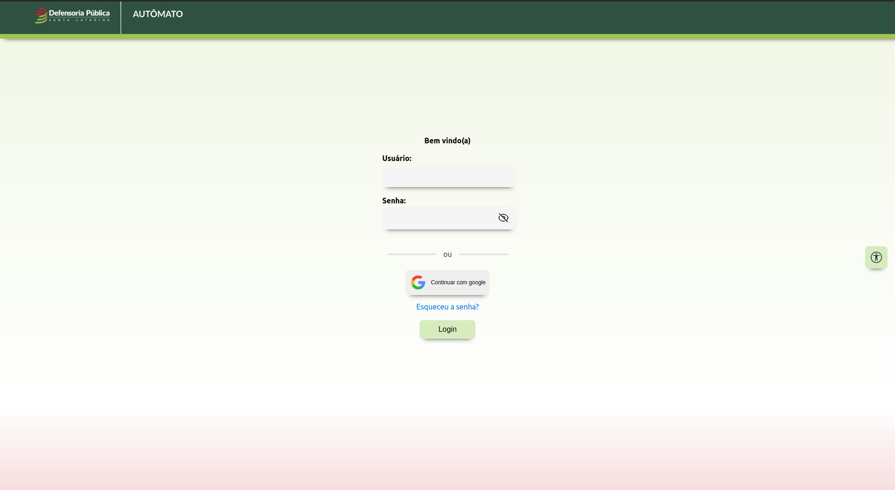
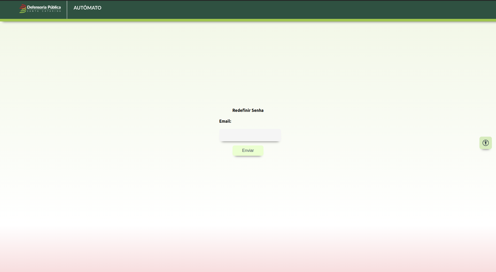
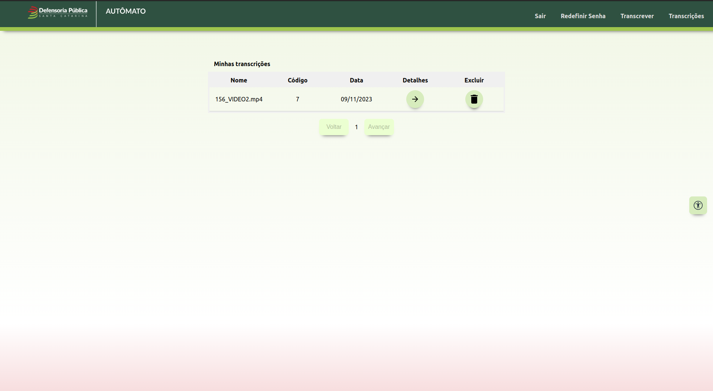
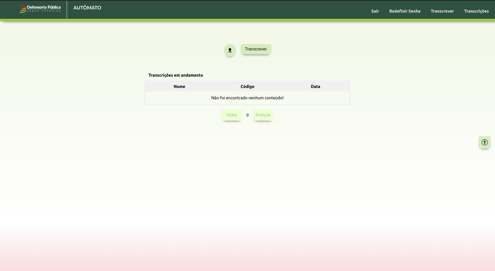

# Autômato

Bem-vindo ao Autômato! Este é um aplicativo web desenvolvido em React com TypeScript para permitir a transcrição das audiências feitas pelos defensores públicos, relacionadas ao estado de Santa Catarina. A aplicação permite que o agendamento das transcrições, ao ser finalizado, poderá acessar o resultado, juntamente com uma pagina de rascunho para efetuar alterações.

## Funcionalidades

- Visualização de transcrições: Navegue pelas transcriçoes do usuário.
- Agendamento de transcrição: Apenas administradores podem criar novas postagens de notícias com o código da notícia, arquivo, tipo de notícia e data de publicação.
- Busca: Pesquise notícias específicas com base em palavras-chave, data ou tipo de notícia.
- Interação: Os usuários podem, agendar e buscar as transcrições na tabela, além de copia-las.

## Pré-requisitos

Certifique-se de ter o Node.js instalado em sua máquina.

## Instalação

1. Clone este repositório: `git clone https://https://github.com/viniciusnau/automato-front`
2. Navegue até o diretório do projeto: `cd automato-front`
3. Instale as dependências: `npm install`

## Uso

1. Inicie o servidor de desenvolvimento: `npm start`
2. Abra o seu navegador e acesse: `http://localhost:3000`

## Contribuição

Contribuições são bem-vindas! No entanto, apenas administradores têm permissão para fazer postagens neste projeto. Se você deseja reportar problemas ou sugestões, sinta-se à vontade para entrar em contato.

---

Agradecemos por escolher o Autômato como projeto para transcrição de audio! Esperamos que esta aplicação seja útil e atenda às suas expectativas. Apreciamos o seu apoio e contribuição.

## Páginas Técnicas:

### Página de Login

Legenda da imagem: Página de login exibindo os campos necessários para acessar a página restrita

A página de login é construída com React e TypeScript, e permite que os usuários acessem o sistema por meio de autenticação. As credenciais são enviadas via requisição POST para um endpoint no backend, onde são verificadas.

### Página de Redefinição de Senha

Legenda da imagem: Página de reset de senha, exibindo o campo de email para alterar/trocar a senha

A página de redefinição de senha permite que os usuários recuperem suas senhas por meio do envio de um e-mail de redefinição. O processo envolve a geração de um token exclusivo, que é associado ao usuário e usado para validar a redefinição.

### Página Inicial (Lista de Transcrições)

Legenda da imagem: Página inicial exibindo as transcrições do usuário.

A página inicial é renderizada com componentes React e exibe os diários mais recentes. As transcrições são obtidas por meio de requisições GET ao servidor e são exibidas na tabela com o arquivo a ser acessado, no qual permite visualizar as palavras que possuem determinada porcentagem de 'incerteza' do servidor, a possibilidade de criar um rascunho, baseado na transcrição e, copiar a transcrição.
Todos os campos existentes para fazer a requisição GET são opcionais.

### Página de Transcrever (juntamente com a Lista de transcrições Agendadas)

Legenda da imagem: Página de transcrever exibindo o campo de agendamento e a tabela com as transcrições agendados.

A página de transcrever possui campos a serem preenchidos para efetuar o agendamento de uma nova transcrição e, há a exibição dos agendamentos futuros. Semelhante à página inicial, utiliza componentes React para mostrar as transcrições agendadas em cartões com detalhes, incluindo nome, código e data de agendamento.
O campo existente para fazer a requisição POST é obrigatório.
